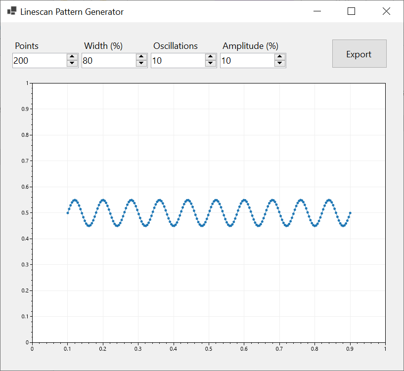

# Linescan Pattern Generator

This application generates laser imaging and stimulation patterns and saves the coordinates as XML files compatible with PrairieView software.



```xml
<?xml version="1.0" encoding="utf-8"?>
<PVLinescanDefinition scanContinuous="False" mode="freeHand">
  <PVFreehand x="0.09999999999999998" y="0.5" />
  <PVFreehand x="0.10402010050251254" y="0.5155259015937085" />
  ...
  <PVFreehand x="0.8959798994974875" y="0.4844740984062912" />
  <PVFreehand x="0.9" y="0.4999999999999999" />
</PVLinescanDefinition>
```